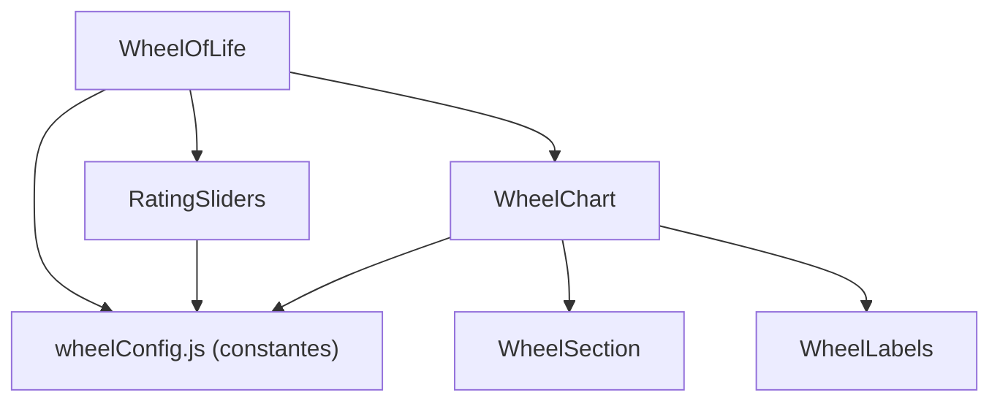

# 🔍 Análisis del Proyecto "Wheel of Life" — Recomendaciones de Mejora

## Resumen General

El proyecto es una aplicación React (creada con **Create React App**) que renderiza una "Rueda de la Vida" interactiva con SVG. Permite al usuario valorar 8 áreas de su vida con sliders y visualizar los resultados en un gráfico radial.

> [!IMPORTANT]
> Este documento es **solo un análisis con recomendaciones**. No se realizó ninguna modificación al código.

---

## 1. 🗂️ Estructura de Archivos

### Estado Actual

Todos los archivos viven directamente dentro de `src/` sin ninguna organización en subcarpetas:

```
src/
├── App.css
├── App.js
├── App.test.js
├── WheelOfLife copy.js    ← archivo duplicado
├── WheelOfLife.css
├── WheelOfLife.js
├── index.css
├── index.js
├── logo-nurvick.png       ← ~1 MB de imagen en src
├── logo-nurvick.svg
├── reportWebVitals.js
└── setupTests.js
```

### Recomendación: Organizar en Carpetas por Responsabilidad

```
src/
├── assets/
│   ├── logo-nurvick.png
│   └── logo-nurvick.svg
├── components/
│   └── WheelOfLife/
│       ├── WheelOfLife.jsx
│       ├── WheelOfLife.css
│       ├── WheelOfLife.test.js
│       ├── WheelSection.jsx        ← sub-componente (segmento SVG)
│       ├── WheelLabels.jsx         ← sub-componente (etiquetas)
│       ├── RatingSliders.jsx       ← sub-componente (sliders)
│       └── index.js                ← re-export
├── constants/
│   └── wheelConfig.js              ← datos: colores, nombres de secciones
├── App.jsx
├── App.css
├── App.test.js
├── index.js
├── index.css
├── reportWebVitals.js
└── setupTests.js
```

> [!TIP]
> Agrupar cada componente con su CSS y test en su propia carpeta facilita la mantenibilidad y la escalabilidad del proyecto.

---

## 2. 🧹 Código Muerto y Archivos Innecesarios

| Archivo / Código | Problema |
|---|---|
| [WheelOfLife copy.js](file:///c:/Users/Usuario/OneDrive/Desktop/Desarrollo/wheel-of-life/src/WheelOfLife%20copy.js) | **Archivo duplicado** de una versión anterior. No se importa en ninguna parte. Debe eliminarse. |
| [App.js](file:///c:/Users/Usuario/OneDrive/Desktop/Desarrollo/wheel-of-life/src/App.js) líneas 13-26 | Bloque de JSX del boilerplate de CRA **comentado**. Debe eliminarse. |
| [App.css](file:///c:/Users/Usuario/OneDrive/Desktop/Desarrollo/wheel-of-life/src/App.css) líneas 18-40 | Estilos `.App-header`, `.App-link` y `@keyframes App-logo-spin` que **ya no se usan**. |
| [public/logo-nurvick.cdr](file:///c:/Users/Usuario/OneDrive/Desktop/Desarrollo/wheel-of-life/public/logo-nurvick.cdr) | Archivo fuente de CorelDraw (~832 KB). No debería estar en producción ni en el repositorio. |

---

## 3. 🐛 Bugs y Errores Detectados

### 3.1 Typo en propiedad CSS inline

En [WheelOfLife.js línea 63](file:///c:/Users/Usuario/OneDrive/Desktop/Desarrollo/wheel-of-life/src/WheelOfLife.js#L63):
```javascript
backgroound: colors[index], // ← "backgroound" (doble 'o')
```
Debería ser `background`. Actualmente este estilo se ignora silenciosamente.

### 3.2 Test roto

En [App.test.js](file:///c:/Users/Usuario/OneDrive/Desktop/Desarrollo/wheel-of-life/src/App.test.js):
```javascript
const linkElement = screen.getByText(/learn react/i);
```
Este test busca el texto "learn react" que ya **no existe** en la aplicación (fue reemplazado por el componente [WheelOfLife](file:///c:/Users/Usuario/OneDrive/Desktop/Desarrollo/wheel-of-life/src/WheelOfLife%20copy.js#4-54)). El test falla siempre.

### 3.3 Conflicto de `margin-top` en CSS

En [WheelOfLife.css líneas 6-7](file:///c:/Users/Usuario/OneDrive/Desktop/Desarrollo/wheel-of-life/src/WheelOfLife.css#L6-L7):
```css
margin-top: 40px;
margin: 0.625rem;  /* ← sobreescribe el margin-top de arriba */
```
El `margin` shorthand sobreescribe el `margin-top` declarado una línea antes, haciéndolo inútil.

---

## 4. 🏗️ Arquitectura del Componente Principal

### Problema: Componente Monolítico

[WheelOfLife.js](file:///c:/Users/Usuario/OneDrive/Desktop/Desarrollo/wheel-of-life/src/WheelOfLife.js) (154 líneas) concentra **toda** la lógica en un solo componente:

- Datos de configuración (colores, nombres de secciones)
- Cálculos matemáticos SVG (ángulos, radios, paths)
- Renderizado de sliders
- Renderizado del gráfico SVG
- Renderizado de etiquetas de texto
- Estado de la aplicación

### Recomendación: Descomponer en Componentes más Pequeños



| Componente | Responsabilidad |
|---|---|
| [WheelOfLife](file:///c:/Users/Usuario/OneDrive/Desktop/Desarrollo/wheel-of-life/src/WheelOfLife%20copy.js#4-54) | Orquestador: maneja estado y compone los sub-componentes |
| `RatingSliders` | Renderiza los sliders con labels |
| `WheelChart` | Renderiza el SVG completo |
| `WheelSection` | Renderiza un segmento individual del gráfico |
| `WheelLabels` | Renderiza las etiquetas de texto alrededor del gráfico |
| `wheelConfig.js` | Exporta `COLORS`, `SECTION_NAMES`, `NUM_SECTIONS`, `NUM_LEVELS`, `RADIUS` |

---

## 5. 📦 Datos Hardcodeados

Los colores y nombres de secciones están definidos **dentro** del componente como arrays literales:

```javascript
// Dentro de WheelOfLife.js
const colors = ['rgba(255, 99, 132, 0.2)', ...];
const sectionNames = ['Familia', 'Trabajo, Empleo', ...];
const numSections = 8;
const numLevels = 10;
const radius = 100;
```

### Recomendación

Mover a un archivo de configuración `constants/wheelConfig.js`:

```javascript
export const SECTION_NAMES = ['Familia', 'Trabajo, Empleo', ...];
export const COLORS = [...];
export const NUM_SECTIONS = 8;
export const NUM_LEVELS = 10;
export const RADIUS = 100;
```

Esto facilita:
- **Internacionalización** futura (cambiar idioma de las secciones)
- **Personalización** (que el usuario agregue/edite secciones)
- **Testing** (inyectar datos de prueba)

---

## 6. ⚡ Rendimiento y Optimización

### 6.1 Imagen PNG de 1 MB en `src/`

El archivo [logo-nurvick.png](file:///c:/Users/Usuario/OneDrive/Desktop/Desarrollo/wheel-of-life/src/logo-nurvick.png) pesa **~1 MB**. Para un logo, esto es excesivo.

**Recomendaciones:**
- Usar la versión SVG ([logo-nurvick.svg](file:///c:/Users/Usuario/OneDrive/Desktop/Desarrollo/wheel-of-life/src/logo-nurvick.svg), 10 KB) en su lugar
- Comprimir el PNG si se necesita formato raster
- Mover assets a `src/assets/`

### 6.2 Re-renders del SVG

Cada cambio en un slider re-renderiza **todo** el SVG completo (8 secciones × 10 niveles = 80 `<path>` elements). Con `React.memo()` en los sub-componentes se podría evitar recalcular secciones que no cambiaron.

---

## 7. 🔧 Mejoras de Tooling y DX

| Área | Estado Actual | Recomendación |
|---|---|---|
| **TypeScript** | No se usa | Migrar a `.tsx` para type safety, especialmente útil para las props de componentes y la configuración |
| **Linter** | Solo ESLint básico de CRA | Agregar reglas más estrictas o usar `eslint-config-airbnb` |
| **Prettier** | No configurado | Agregar `.prettierrc` para formato consistente (actualmente hay mezcla de CRLF y LF) |
| **Pre-commit hooks** | No configurados | Agregar `husky` + `lint-staged` |
| **Extensiones de archivo** | [.js](file:///c:/Users/Usuario/OneDrive/Desktop/Desarrollo/wheel-of-life/src/App.js) | Usar `.jsx` para archivos con JSX (convención React) |

---

## 8. 🧪 Testing

### Estado Actual
- Solo un test en [App.test.js](file:///c:/Users/Usuario/OneDrive/Desktop/Desarrollo/wheel-of-life/src/App.test.js) que está **roto** (busca "learn react" que no existe)
- No hay tests para [WheelOfLife](file:///c:/Users/Usuario/OneDrive/Desktop/Desarrollo/wheel-of-life/src/WheelOfLife%20copy.js#4-54)

### Recomendación
- Corregir o reescribir [App.test.js](file:///c:/Users/Usuario/OneDrive/Desktop/Desarrollo/wheel-of-life/src/App.test.js) para verificar que [WheelOfLife](file:///c:/Users/Usuario/OneDrive/Desktop/Desarrollo/wheel-of-life/src/WheelOfLife%20copy.js#4-54) se renderiza
- Agregar tests para [WheelOfLife](file:///c:/Users/Usuario/OneDrive/Desktop/Desarrollo/wheel-of-life/src/WheelOfLife%20copy.js#4-54):
  - Que se renderizan los 8 sliders
  - Que mover un slider actualiza el valor mostrado
  - Que el botón "Mostrar Rueda" / "Ocultar Rueda" funciona
  - Que el SVG se renderiza con las secciones correctas

---

## 9. 📄 Metadatos y SEO

En [public/index.html](file:///c:/Users/Usuario/OneDrive/Desktop/Desarrollo/wheel-of-life/public/index.html):

| Elemento | Estado Actual | Recomendación |
|---|---|---|
| `<title>` | `"React App"` | Cambiar a `"Rueda de la Vida"` |
| `<meta description>` | `"Web site created using create-react-app"` | Actualizar con descripción del proyecto |
| `<html lang>` | `"en"` | Cambiar a `"es"` (el contenido está en español) |

---

## 10. 📊 Resumen de Prioridades

| Prioridad | Mejora | Impacto |
|---|---|---|
| 🔴 Alta | Eliminar `WheelOfLife copy.js` | Limpieza inmediata |
| 🔴 Alta | Corregir typo `backgroound` → `background` | Bug fix |
| 🔴 Alta | Corregir/reescribir el test roto | Calidad de código |
| 🟡 Media | Reorganizar `src/` en subcarpetas | Mantenibilidad |
| 🟡 Media | Extraer datos a archivo de constantes | Separación de responsabilidades |
| 🟡 Media | Descomponer [WheelOfLife](file:///c:/Users/Usuario/OneDrive/Desktop/Desarrollo/wheel-of-life/src/WheelOfLife%20copy.js#4-54) en sub-componentes | Escalabilidad |
| 🟡 Media | Eliminar código comentado y estilos muertos | Limpieza |
| 🟢 Baja | Usar SVG en vez de PNG para el logo | Rendimiento |
| 🟢 Baja | Agregar Prettier y pre-commit hooks | DX |
| 🟢 Baja | Migrar a TypeScript | Type safety |
| 🟢 Baja | Actualizar meta tags en [index.html](file:///c:/Users/Usuario/OneDrive/Desktop/Desarrollo/wheel-of-life/public/index.html) | SEO |
